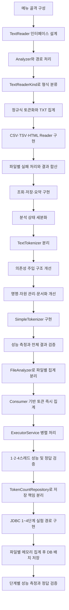

# 문서 단어 분석기 개발 진행 과정

## 1. 프로젝트 개요

TXT, CSV, TSV, HTML 문서에서 분석 대상 텍스트를 읽고, 정해진 규칙으로 토큰을 추출하여 단어별 출현 횟수를 집계하는 Java 콘솔 프로그램 구현

- 개발 환경: JDK 21, IntelliJ IDEA, UTF-8
- 실행 클래스: `kr.sesac.wordcounter.Main`
- 주요 기능
  - 파일 또는 폴더 분석
  - TXT, CSV, TSV, HTML/HTM 처리
  - 여러 파일의 고정 스레드 풀 병렬 처리
  - 상위 N개 단어 조회
  - 특정 단어 횟수 조회
  - 전체 결과 TSV 저장
  - 최근 분석 요약 출력
  - 잘못된 입력 및 파일별 분석 실패 처리
  - 메모리 또는 MySQL 기반 집계 결과 저장·조회
  - JDBC 트랜잭션·배치 방식의 단계별 성능 비교
### 1.1 현재 기본 설정

| 구분 | 설정 |
|---|---|
| CSV 분석 열 | `text` |
| TSV 분석 열 | `document` |
| HTML 본문 선택자 | `#content` |
| 결과 저장 경로 | `out/counts.tsv` |
| 기본 Repository | `InMemoryRepository` |
| DB 실습 환경 | MySQL 8.4, `localhost:3307`, 데이터베이스 `wordcount` |

- CSV 다중 열 분석 설정 위치: `TextReaderKind`의 `CsvReader` 생성 부분
- Chatbot 데이터 분석 설정 예시: `List.of("Q", "A")`

## 2. 개발 흐름

Git 기록과 초기 메모를 기준으로 정리한 2026년 9월 22일 초기 구현 및 9월 24일 요구사항 반영 과정

| 날짜 | 단계 | 주요 내용 |
|---|---|---|
| 2026-09-22 | 초기 구조 설계 | 메뉴 골격, `TextReader`, `Analyzer`, `TextReaderKind` 구성 |
| 2026-09-22 | 기본 분석 흐름 구성 | 경로 처리, 확장자 분류, 파일별 Reader 선택 |
| 2026-09-24 | 필수 기능 구현 | 네 형식 처리, 토큰 집계, 조회·저장·요약 구현 |
| 2026-09-24 이후 | 요구사항 검토 및 리팩터링 | 오류 상태 구분, 토크나이저 분리, 의존성 주입, 명명과 자원 관리 개선 |
| 2026-09-25 | 심화 성능 개선 | `SimpleTokenizer` 구현, 정규식 방식과 성능·정확성 비교 |
| 2026-09-26 | 여러 파일 병렬 처리 | 파일별 독립 집계, 토큰 즉시 전달, 고정 스레드 풀, 완료 결과 합산 구현 |
| 2026-09-26 | DB 심화 사전 구조 개선 | `TokenCountRepository` 추상화, 메모리 저장 구현 분리, 패키지·수명 주기 정리 |
| 2026-09-28 | DB 단계별 집계 구현 | MySQL·JDBC 연결, 1~4단계 실험 경로, 5단계 `JdbcRepository` 저장·조회 구현 |
| 2026-09-28 | DB 검증과 예외 처리 보완 | 단계별 성능 측정, 정답 비교, 롤백·자원 정리·오류 문구 개선 |



### 2.1 콘솔 메뉴 골격 구성

- 제공 기능을 기준으로 세부 구현이 없는 메뉴 메서드 우선 구성
- `Main`에서 사용자 입력과 기능 호출 흐름 우선 분류
- 세부 기능보다 전체 프로그램 제어 흐름 우선 확인

```text
새 분석 시작
상위 N개 단어 보기
특정 단어 횟수 찾기
전체 결과 저장
최근 분석 요약 보기
종료
```

### 2.2 파일 형식별 Reader 구조 설계

- TXT, CSV, TSV, HTML의 공통된 문서 읽기 동작을 `TextReader` 인터페이스로 추상화
- 구체적인 파일 처리보다 공통 타입과 호출 계약 우선 구성
- 형식별 문서를 읽고 분석에 필요한 토큰을 소비하는 역할로 `TextReader` 정의

```text
TextReader
├─ TxtReader
├─ DelimitedTableReader
│  ├─ CsvReader
│  └─ TsvReader
└─ HtmlReader
```

| 클래스 | 역할 |
|---|---|
| `TxtReader` | 파일을 한 줄씩 읽고 각 줄의 토큰 소비 |
| `CsvReader` | CSV 레코드에서 지정 열의 셀 토큰 소비 |
| `TsvReader` | TSV 레코드에서 지정 열의 셀 토큰 소비 |
| `HtmlReader` | 지정 본문 요소에서 불필요한 요소를 제외한 토큰 소비 |
| `DelimitedTableReader` | CSV·TSV 공통 헤더 및 레코드 검증 |

### 2.3 `Analyzer`와 입력 경로 처리

- 입력 경로에서 파일 목록을 만들고 파일별 분석을 조정하는 역할로 `Analyzer` 정의
- 입력 문자열을 `Path`로 변환한 후 파일과 폴더 구분
- 일반 파일 입력 시 해당 파일 하나를 분석 대상으로 구성
- 폴더 입력 시 바로 아래의 일반 파일만 분석 대상으로 구성
- 하위 폴더 제외
- 잘못된 경로 형식과 존재하지 않는 경로 구분
- `Files.list()` 스트림의 `try-with-resources` 관리

설계 과정의 주요 고려 사항

- 파일과 폴더의 구분 방법
- 폴더 내 일반 파일의 나열 방법
- 미지원 파일의 제외 시점
- 지원 파일 부재 시 기존 분석 결과 유지 여부
- 새 분석 시작 시점과 이전 결과 초기화 시점

### 2.4 확장자와 Reader 생성 연결

- 지원 확장자: `.txt`, `.csv`, `.tsv`, `.html`, `.htm`
- 확장자 대소문자 비구분 처리
- 확장자와 Reader 생성 방법을 `TextReaderKind` 열거형으로 관리
- `fromExtension()`을 통한 확장자별 열거형 값 반환
- 각 열거형 값의 `TextReader` 생성 방법 보유
- `Analyzer`와 `Main`에서 형식별 조건문 제거

새 파일 형식 추가 시 주요 변경 지점

1. 새로운 `TextReader` 구현 클래스 추가
2. `TextReaderKind`에 확장자와 Reader 생성 방법 등록

### 2.5 정규식 토큰화와 TXT 집계

- 파일 처리 구조 완성 후 실제 집계 대상 토큰 규칙 구현
- 영문자, 숫자, 한글 완성형·자모의 연속 부분 추출
- 영문 소문자 변환
- 숫자 전용 토큰 제외
- 문장부호, 이모지, 한자 등의 토큰 경계 처리
- `BufferedReader`를 이용한 TXT 한 줄 단위 처리
- `Map<String, Long>`을 이용한 토큰별 횟수 집계
- 전체 등장 횟수와 서로 다른 토큰 수의 별도 관리

### 2.6 CSV·TSV·HTML Reader 구현

#### TXT 처리

- UTF-8 기반 한 줄 단위 읽기
- 줄 경계를 토큰 경계로 유지

#### CSV 처리

- Apache Commons CSV의 RFC 4180 형식 사용
- 따옴표로 감싼 값, 셀 내부 쉼표, 이중 따옴표, 셀 내부 줄바꿈 처리
- 단순 `split(",")` 방식 제외
- 대상 열의 각 셀을 독립적으로 토큰화

#### TSV 처리

- 탭 구분자 사용
- 제공 데이터 기준 따옴표의 일반 문자 처리
- 대상 열의 각 셀을 독립적으로 토큰화

#### CSV·TSV 공통 처리

- 공통 로직의 `DelimitedTableReader` 이동
- 헤더 검사
- 대상 열 인덱스 탐색
- 레코드 너비 검사
- 대상 셀 토큰화
- 분석 대상 열의 목록화
- `Q`와 `A` 같은 다중 열 분석 지원

#### HTML 처리

- jsoup 기반 UTF-8 문서 읽기
- 지정 CSS 선택자의 본문 요소 탐색
- 선택 결과가 정확히 한 개인지 확인
- 본문 내부 `script`, `style`, `nav`, `header`, `footer` 제거
- `element.text()` 결과의 전체 토큰화

HTML 문단 또는 텍스트 노드 단위 분리를 사용하지 않은 이유

- 형식 간 공통된 텍스트 조각 의미의 부재
- TXT의 줄, CSV·TSV의 셀, HTML의 전체 본문처럼 서로 다른 자연 처리 단위
- 불필요한 중간 텍스트 조각 컬렉션 방지
- 각 Reader 내부에서 형식에 적합한 단위 처리

### 2.7 파일별 실패 처리와 결과 합산

- Reader 내부에서 파일 하나의 토큰 목록 완성
- Reader 성공 후에만 전체 집계 반영
- 파싱 중 실패한 파일의 앞부분 토큰 제외
- 파일별 `IOException` 처리 후 다음 파일 분석 지속
- 실패 파일 경로와 원인 출력
- 성공 파일 결과만 전체 집계에 합산

CSV·TSV 오류 처리 대상

- 빈 파일과 헤더 부재
- 지정 대상 열 누락
- 헤더 수와 레코드 셀 수 불일치
- 닫히지 않은 CSV 따옴표
- 반복 처리 중 `UncheckedIOException`
- 셀 접근 중 `IllegalArgumentException`

### 2.8 조회·저장·요약 구현

#### 분석 요약

- 입력 경로
- 시도한 지원 파일 수
- 성공 파일 수
- 실패 파일 수
- 미지원으로 건너뛴 파일 수
- 전체 단어 수
- 서로 다른 단어 수
- 처리 시간
- 지원 파일 목록 확정 후 첫 파일 읽기 직전부터 전체 합산 완료까지 `System.nanoTime()` 측정

#### 상위 N개 조회

- 횟수 내림차순 정렬
- 동일 횟수에서 `String.compareTo()` 오름차순 정렬
- 큰 `long` 값에 안전한 `Long.compare()` 사용
- 빈 입력의 기본값 10 적용
- 1 이상의 정수만 허용
- 단어 종류 수보다 큰 N의 기존 단어까지만 출력

#### 특정 단어 조회

- 파일 분석과 동일한 토큰화 규칙 적용
- `JAVA!` 입력의 `java` 정규화
- 유효 토큰 부재 또는 다중 토큰 입력의 재입력 처리
- 조회 결과의 정규화 토큰 출력

#### 전체 결과 저장

- 저장 경로 `out/counts.tsv`
- 출력 폴더 자동 생성
- UTF-8 저장
- `word\tcount` 헤더 출력
- 전체 단어의 조회와 동일한 정렬 순서 적용
- 기존 결과 파일 덮어쓰기
- 저장 실패 원인 안내
- 저장 실패 후 기존 분석 결과 유지

### 2.9 분석 상태 세분화

#### 지원 파일 부재

- 분석 미시작
- 경로 재입력
- 이전 정상 분석 결과 유지

#### 일부 파일 성공

- 성공 파일 결과만 합산
- 실패 파일 통계와 원인 유지
- 조회·저장 허용

#### 빈 파일 정상 처리

- 성공 파일 수 증가
- 전체 단어 0개 결과 유지
- 조회와 헤더 전용 저장 허용

#### 모든 파일 실패

- 실패 요약 유지
- 이전 결과 대체
- 요약 조회 허용
- 상위 조회, 특정 단어 조회, 결과 저장 금지

반복 상태 검사의 공통 메서드 분리

```text
분석 객체 존재 여부
  ↓
성공 파일 존재 여부
```

### 2.10 토큰 결과 값 객체 도입

- 정렬된 토큰과 횟수를 함께 전달하기 위한 `TokenCount` record 추가
- 상위 단어 조회, 특정 단어 조회, 결과 저장의 공통 결과 타입 사용
- null 불필요성에 따른 기본형 `long` 사용

```java
public record TokenCount(String token, long count) {}
```

### 2.11 토큰화 규칙 인터페이스 분리

- 정적 유틸리티 성격의 `TextFilter`에서 교체 가능한 `TextTokenizer` 인터페이스로 변경
- 정규식 구현을 `RegexTokenizer`로 분리
- 파일 형식과 집계 방식으로부터 토큰화 규칙 분리
- 파일 분석과 특정 단어 조회의 동일 토큰화 규칙 적용

```text
TextTokenizer
└─ RegexTokenizer
```

### 2.12 토크나이저 의존성 주입 개선

초기 검토 방식

- Reader의 `RegexTokenizer` 직접 생성 방식
- Reader 생성자의 `TextTokenizer` 주입 방식

최종 방식

- `Main`에서 구체적인 `TextTokenizer` 구현 선택
- `Analyzer` 생성자에서 분석 전체의 `TextTokenizer` 주입 및 보관
- `TextReader.readTokens()` 호출 시 토크나이저와 토큰 소비자의 메서드 주입
- 특정 단어 조회에서 `Analyzer`가 보관한 동일 토크나이저 사용
- Reader 생성자에는 CSV 대상 열, TSV 대상 열, HTML 선택자 같은 형식별 설정만 유지

```text
Main
└─ TextTokenizer 구현 선택
   ↓
Analyzer
├─ 특정 단어 조회
└─ TextReader.readTokens(filePath, tokenizer, tokenConsumer)
```

### 2.13 이름·자원 관리·문서화 개선

- `TokenInfo`에서 `TokenCount`로 변경
- `Long count`에서 `long count`로 변경
- `TextFilter`에서 `TextTokenizer`로 변경
- `RegexTextFilter`에서 `RegexTokenizer`로 변경
- `getTextReader()`에서 `createReader()`로 변경
- 토큰 횟수 Comparator 이름 구체화
- `Files.list()`의 `try-with-resources` 처리
- 사용하지 않는 import 제거
- 공개 인터페이스와 값 객체의 Javadoc 적용 검토

### 2.14 `SimpleTokenizer`를 이용한 단일 파일 처리 성능 개선

정규식 검색 비용 감소를 위한 문자열 직접 검사 방식의 `SimpleTokenizer` 구현. 기존 `TextTokenizer` 인터페이스를 유지하여 Reader와 `Analyzer` 수정 없이 토크나이저 구현만 교체할 수 있는 비교 구조 구성

#### 구현 과정

1. 최초 구현: 허용 문자를 만날 때마다 `StringBuilder`에 추가하고, 구분자를 만나면 완성된 문자열을 토큰 목록에 넣는 방식
2. 최초 방식의 한계: 원문 문자열에 연속해서 존재하는 모든 토큰 문자를 `StringBuilder`에 하나씩 다시 복사하는 비용 발생
3. 최종 구현: 현재 토큰의 `startIndex`만 저장한 상태에서 문자열 순회
4. 토큰 추출: 영문자·한글 또는 숫자가 이어지는 동안 인덱스만 이동하고, 구분자를 만났을 때 `substring(startIndex, i)`로 한 번에 추출
5. 숫자 전용 토큰 제외: `containsLetter` 상태를 이용한 영문자 또는 한글 포함 여부 확인
6. 마지막 토큰 처리: 문자열 끝까지 토큰이 이어지는 경우 반복문 종료 후 `substring(startIndex)`로 추가
7. 대소문자 정규화: 추출한 토큰을 `Locale.ROOT` 기준 소문자로 변환하여 기존 `RegexTokenizer`와 동일한 결과 유지

```text
문자열 순회
  ↓
허용 문자이면 현재 구간 유지
  ↓
영문자·한글을 만나면 containsLetter = true
  ↓
구분자를 만나면 startIndex부터 현재 위치 전까지 substring
  ↓
containsLetter가 true인 구간만 소문자로 변환하여 추가
```

#### 구현 선택 이유

| 방식 | 특징 | 최종 판단 |
|---|---|---|
| 정규식 | 구현이 간결하고 규칙을 읽기 쉬움 | 기준 구현과 정확성 비교에 유지 |
| `StringBuilder` | 문자 검사 방식이지만 각 문자를 별도 버퍼에 다시 추가 | 불필요한 문자 복사 감소를 위해 변경 |
| 시작 인덱스와 `substring()` | 원문에서 토큰 범위만 기억하고 완성 시 한 번에 추출 | 최종 구현으로 선택 |

#### 성능 및 정확성 검증

같은 기기와 JDK에서 예열 후 각각 3회 측정한 값의 중앙값 비교. 파일 읽기부터 전체 결과 합산 완료까지를 측정 구간으로 설정하고 정렬과 결과 저장은 제외

| 버전 | 입력 | 1회(ms) | 2회(ms) | 3회(ms) | 중앙값(ms) | 전체 결과 동일 |
|---|---|---:|---:|---:|---:|---|
| `RegexTokenizer` | `data/performance/news-repeat-8.csv` | 585 | 598 | 599 | 598 | O |
| `SimpleTokenizer` | 같은 파일 | 375 | 386 | 400 | 386 | O |

| 버전 | 입력 | 1회(ms) | 2회(ms) | 3회(ms) | 중앙값(ms) | 전체 결과 동일 |
|---|---|---:|---:|---:|---:|---|
| `RegexTokenizer` | `data/local/perf-64/news-repeat-64.csv` | 4817 | 4989 | 4765 | 4817 | O |
| `SimpleTokenizer` | 같은 파일 | 3116 | 2937 | 2949 | 2949 | O |

- 약 27.3MB 입력에서 중앙값 기준 약 35% 감소
- 약 208MB 입력에서 중앙값 기준 약 38% 감소
- 두 구현의 전체 단어 수, 종류 수, 모든 단어별 횟수 일치 확인
- 정규식 매칭을 문자 범위 검사와 인덱스 관리로 바꾸어 토큰 분리 비용 감소

### 2.15 파일별 독립 집계와 토큰 즉시 전달

여러 파일의 동시 처리를 위한 선행 단계로 파일 하나의 분석 책임을 `FileAnalyzer`로 분리. 각 작업이 독립적인 집계 상태를 갖도록 파일 경로, 형식별 Reader, 토크나이저, 파일별 `Map<String, Long>`, 파일별 전체 단어 수를 하나의 객체로 구성

#### 기존 구조의 한계

```text
TextReader
  ↓
파일 전체 토큰을 List<String>으로 반환
  ↓
Analyzer의 전체 Map에 직접 집계
```

- 한 파일의 모든 토큰 목록 완성 후 집계 시작
- 병렬 처리 시 여러 파일의 전체 토큰 목록 동시 보관 가능성
- 여러 작업이 전체 집계 Map을 직접 수정할 경우 갱신 누락 가능성
- 파일 처리 책임과 전체 결과 합산 책임의 `Analyzer` 집중

#### 파일별 집계 분리

```text
Analyzer
  ↓ 파일별 작업 생성
FileAnalyzer
├─ 파일 전용 TextReader
├─ 공통 TextTokenizer
├─ 파일별 countsByToken
└─ 파일별 wordCount
```

- 각 파일마다 별도의 `FileAnalyzer`와 `HashMap` 생성
- 파일 읽기·토큰화·파일별 횟수 집계의 하나의 작업 단위 구성
- 파일 처리가 완전히 성공한 경우에만 전체 결과 합산
- 실패 파일의 부분 집계가 전체 결과에 반영되지 않는 기존 규칙 유지
- 전체 단어 수와 파일별 단어 수의 `long` 통일

#### `Consumer<String>` 기반 즉시 집계

`TextReader`의 반환 계약을 `List<String> getTokens(...)`에서 `void readTokens(..., Consumer<String>)`로 변경. Reader가 토큰을 발견할 때마다 `FileAnalyzer`의 소비자에게 전달하는 구조 적용

```text
파일의 한 줄·레코드·본문 읽기
  ↓
현재 범위 토큰화
  ↓
토큰 하나씩 Consumer에 전달
  ↓
FileAnalyzer의 Map에 즉시 반영
```

- TXT의 한 줄 단위 토큰 전달
- CSV·TSV의 레코드와 분석 대상 셀 단위 토큰 전달
- HTML의 선택된 본문 토큰 전달
- 파일 전체 토큰 목록 제거에 따른 중간 컬렉션 보관 범위 감소
- Reader의 형식 해석 책임과 `FileAnalyzer`의 집계 책임 분리

### 2.16 여러 파일 병렬 처리

#### 순차 처리 기준 구조

- 지원 파일을 하나씩 `FileAnalyzer`로 처리
- 파일별 성공 결과를 `integrate()`에서 전체 Map으로 합산
- 파일별 `IOException`을 경로와 함께 실패 목록에 보관
- 병렬 처리 전 결과와 오류 규칙 확인을 위한 기준 경로 유지

#### 고정 크기 스레드 풀 적용

`ExecutorService`의 고정 크기 스레드 풀을 이용한 파일별 작업 제출. 지원 파일 수와 최대 스레드 수 중 작은 값을 실제 작업 스레드 수로 선택

```text
지원 파일 목록
  ↓
파일별 Callable 제출
  ↓
고정 크기 스레드 풀에서 동시 처리
  ↓
Future 완료 대기
  ↓
성공한 FileAnalyzer 결과만 순차 합산
```

- 최대 스레드 수의 `MAX_THREAD_COUNT` 상수 관리
- 1·2·4스레드 비교 시 같은 병렬 처리 경로와 상수값만 변경
- 파일 경로와 `Future<FileAnalyzer>`의 Map 구성
- 파일별 `TextReader` 생성과 분석 작업의 작업 스레드 실행
- `ExecutorService`의 `try-with-resources` 종료 관리
- 모든 작업 완료 후 메인 스레드의 `Future.get()` 결과 수집
- 전체 `countsByToken`의 단일 스레드 합산으로 동시 수정 방지
- 파일 처리와 모든 결과 합산 완료 시점까지 처리 시간 측정

#### 실패 결과와 요약 객체 분리

- 파일 경로와 실패 원인을 담는 `FileAnalysisFailure` record 도입
- 파일 시도·성공·건너뜀 수를 담는 `FileAnalysisSummary` record 도입
- 전체 단어 수와 종류 수를 담는 `WordAnalysisSummary` record 도입
- 입력 경로, 파일 요약, 단어 요약, 처리 시간, 실패 목록을 담는 `AnalysisSummary` record 도입
- 작업 스레드의 직접 콘솔 출력 제거와 분석 완료 후 `Main`의 실패 정보 출력
- `ExecutionException`의 원인이 `IOException`인 경우 해당 파일만 실패 처리
- 인터럽트·작업 취소·예상하지 못한 작업 예외의 전체 분석 오류 전달

#### 설계 결과

| 구분 | 처리 방식 |
|---|---|
| 파일 내부 처리 | `FileAnalyzer`의 전용 Map 사용 |
| 여러 파일 실행 | 고정 크기 `ExecutorService` 사용 |
| 작업 결과 식별 | 파일 경로와 `Future` 연결 |
| 전체 결과 합산 | 작업 완료 후 메인 스레드에서 순차 처리 |
| 파일별 오류 | 경로와 원인을 실패 목록에 보관 |
| 처리 시간 | 첫 파일 처리 직전부터 전체 합산 완료까지 측정 |

### 2.17 데이터베이스 심화 작업 전 역할 분리

기존 기능과 정답을 유지하면서 저장 위치를 메모리 `Map`에서 데이터베이스로 교체하기 위한 분석 책임과 저장·조회 책임의 분리. 별도의 메모리용·DB용 Analyzer 방안과 단일 `Analyzer`에 Repository를 조합하는 방안의 비교 후, 저장 방식과 무관한 파일 탐색·Reader 선택·실패 처리 흐름의 중복 방지를 위한 단일 `Analyzer` 구조 선택

```text
Main
  ↓ 분석 시작·결과 조회
Analyzer
  ├─ FileTokenCounter: 파일 하나의 토큰 집계
  └─ TokenCountRepository: 전체 결과 저장·조회
       ├─ InMemoryRepository
       └─ JdbcRepository
```

#### `Analyzer`의 직접 Map 관리 제거

기존 `Analyzer`가 전체 집계용 `Map<String, Long>`을 직접 보유하며 수행하던 작업

- 성공한 파일별 결과의 전체 합산
- 서로 다른 토큰 개수 계산
- 상위 N개 정렬과 제한
- 전체 결과 정렬
- 특정 토큰 조회

DB 저장 방식에서 같은 조회 기능을 SQL로 구현하기 위한 `TokenCountRepository` 계약 도입. `Analyzer`에는 분석 흐름과 외부 조회 창구를 유지하고 실제 저장·조회는 Repository에 위임

| 책임 | 담당 |
|---|---|
| 입력 경로·지원 파일 검사 | `Analyzer` |
| 순차·병렬 파일 처리 조정 | `Analyzer` |
| 파일 하나의 임시 토큰 집계 | `FileTokenCountResult` |
| 파일별 성공 결과의 전체 저장 | `TokenCountRepository.addAll()` |
| 종류 수 조회 | `TokenCountRepository.getUniqueCount()` |
| 상위·전체·특정 토큰 조회 | `TokenCountRepository` 구현체 |
| 콘솔 입력·출력 | `Main` |

Repository에서 `getAllTokens()`만 제공하고 `Analyzer`가 정렬하는 방안과 저장 위치에서 정렬하는 방안의 비교. DB의 전체 행을 Java로 가져오는 비용과 SQL의 `ORDER BY`·`LIMIT` 활용을 고려한 `findTop()`·`findAllSorted()` 계약 선택

#### 클래스와 패키지 의미 정리

- `FileAnalyzer`는 파일 형식을 판별하거나 분석 전체를 조정하지 않고 파일 하나의 토큰 빈도만 세므로 `FileTokenCountResult`로 변경
- `FileTokenCountResult`는 `Analyzer`만 사용하는 패키지 전용 구현이므로 `analysis` 패키지 유지
- 실행 요약·파일 통계·실패 정보는 `analysis.result`로 이동
- `TokenCount`는 분석, Repository, 조회, TSV 출력이 함께 사용하는 핵심 값이므로 `model`로 이동
- `readers`, `tokenizers`는 클래스 모음보다 책임 영역을 나타내도록 `reader`, `tokenizer` 단수형으로 통일
- 향후 저장소 영역도 같은 기준으로 `repository` 단수형 사용

#### 분석별 Repository 수명 주기

초기에는 `Main`의 정적 필드에 단일 `InMemoryRepository`를 두고 새 `Analyzer`마다 같은 객체를 전달하여 동일 입력 재분석 시 결과 누적 발생. 메모리 구현에서는 분석별 새 객체 생성 방식을 먼저 적용했으나, DB 테이블은 Repository 객체를 새로 만들어도 데이터가 유지되는 차이 확인

```text
잘못된 구조
첫 번째 분석 ─┐
              ├─ 동일한 Repository → 결과 누적
두 번째 분석 ─┘

최종 공통 구조
입력 경로·지원 파일 검증
  ↓ 유효한 분석 대상 확정
Repository.clear()
  ↓
새 분석 결과 저장
```

메모리와 DB에 같은 초기화 규칙을 적용하기 위한 `TokenCountRepository.clear()` 계약 추가. 잘못된 경로나 지원 파일 부재가 확인되기 전에 기존 결과가 삭제되지 않도록 입력 검증 후 초기화 실행. 생성자에서 `TRUNCATE`를 실행하는 숨은 부작용 대신 `Analyzer`가 유효한 분석 시작 시점을 통제하는 구조 선택

- `InMemoryRepository.clear()`의 Map 초기화
- `JdbcRepository.clear()`의 `word_counts`·`tokens` 테이블 초기화
- 잘못된 경로·지원 파일 부재 시 기존 정상 결과 유지
- 새 분석 확정 후 이전 결과에 더하지 않는 필수 규칙 유지

#### 데이터베이스 집계 단계와 현재 구조의 관계

심화 과제의 DB를 분석 이력 저장소가 아닌 현재 분석 한 번의 결과를 담는 작업용 저장소로 정의. `analysis_id`가 없는 구조에서 프로그램 종료 후 남은 결과의 다음 분석 누적 방지를 위한 분석 시작 전 초기화 적용

| 단계 | 집계·저장 방식 | 현재 구조와의 연결 |
|---|---|---|
| 1~3단계 | 토큰마다 즉시 SQL 실행 | `JdbcTestAnalyzer`와 `JdbcTestSession`의 토큰 단위 실험 경로 |
| 4단계 | 토큰을 5,000개씩 배치로 DB 반영 | `JdbcTestSession` 내부 배치 누적과 실행 |
| 5단계 | 파일별 메모리 Map 집계 후 결과 배치 저장 | `FileTokenCountResult`와 `JdbcRepository.addAll()`의 운영 경로 |
| 6단계 | 원시 토큰을 `tokens`에 저장한 뒤 DB에서 집계 | 미구현 선택 과제 |

1~4단계의 교육용 토큰 단위 경로와 5단계의 운영용 파일별 집계 경로 분리. `FileTokenCountResult`에 JDBC 코드를 넣지 않고 DB 접근을 Repository가 담당하는 책임 경계 유지

### 2.18 데이터베이스 저장·집계 구현

#### 실행 환경과 스키마 구성

- Docker Compose 기반 MySQL 8.4 컨테이너 구성
- 로컬 MySQL과의 충돌 방지를 위한 `localhost:3307` 포트 사용
- MySQL Connector/J 9.3.0 Maven 의존성 추가
- 현재 분석 결과용 `word_counts` 테이블과 6단계 실험용 `tokens` 테이블 구성
- 대소문자와 유사 문자를 서로 다른 토큰으로 유지하기 위한 `utf8mb4_bin` 정렬 규칙 적용
- Java `String.compareTo` 기준과 같은 결과 순서를 얻기 위한 DB 정렬 규칙 통일

```text
텍스트 입력
  ↓ TextReader + TextTokenizer
파일별 토큰 집계
  ↓ Collection<TokenCount>
JdbcRepository.addAll()
  ↓ 배치 UPSERT + 트랜잭션
word_counts
  ↓ ORDER BY / LIMIT / WHERE
조회·TSV 저장
```

#### 1~4단계 실험 경로 구현

기존 `FileTokenCountResult`는 파일 안의 토큰을 먼저 Map으로 집계하므로 토큰마다 SQL을 실행하는 1~4단계 실험과 직접 연결되지 않는 구조. 필수 기능용 `Analyzer`를 변형하지 않고 단계별 차이를 비교하기 위한 `JdbcTestAnalyzer`, `JdbcTestRepository`, `JdbcTestSession`, `DbAggregationMode`의 별도 실험 경로 구성

| 단계 | 구현 방식 | 확인한 성능 요인 |
|---|---|---|
| 1 | 토큰마다 `SELECT` 후 `INSERT` 또는 `UPDATE`, 자동 커밋 | 토큰당 최대 두 번의 SQL 왕복과 매 문장 커밋 비용 |
| 2 | 토큰마다 UPSERT 한 번, 자동 커밋 | SQL 왕복 횟수 감소 |
| 3 | 토큰마다 UPSERT, 자동 커밋 해제, 마지막 한 번 커밋 | 반복 디스크 확정 비용 제거 |
| 4 | 5,000개 단위 `addBatch()`·`executeBatch()`, 마지막 커밋 | SQL 왕복 횟수 대폭 감소 |

- 1·2단계의 자동 커밋 유지와 3·4단계의 명시적 트랜잭션 구분
- `complete()` 호출 시 남은 배치 실행과 최종 커밋 수행
- `complete()` 이전 실패 시 `close()`의 롤백을 통한 부분 집계 취소
- `PreparedStatement`, `ResultSet`, `Connection`의 소유권별 자원 정리
- SQL 문자열 연결 대신 매개변수 바인딩 사용

#### 5단계 운영 경로 구현

- 파일마다 `FileTokenCountResult`의 `HashMap`으로 토큰별 횟수 선집계
- 성공한 파일의 집계 결과만 `TokenCountRepository.addAll()`에 전달
- `INSERT ... VALUES (?, ?) ON DUPLICATE KEY UPDATE`를 이용한 파일별 횟수 합산
- 한 파일의 서로 다른 토큰 수만큼 배치 문장 추가 후 한 번의 `executeBatch()` 실행
- 파일별 트랜잭션 커밋을 통한 실패 파일 부분 결과 배제
- DB의 `COUNT(*)`, `ORDER BY count DESC, word ASC`, `LIMIT`, `WHERE word = ?`를 이용한 종류 수·상위·전체·특정 단어 조회
- 메모리 저장과 DB 저장에서 같은 `Analysis` 조회 계약 유지

#### 단계별 측정 결과

동일한 개인 PC, JDK 21, IntelliJ IDEA 실행 설정, `SimpleTokenizer` 사용. 각 단계 실행 전 테이블 초기화, 예열 1회 후 3회 측정, 파일 읽기부터 마지막 배치 실행과 커밋 완료까지의 중앙값 비교

| 단계 | 입력 | 1회(ms) | 2회(ms) | 3회(ms) | 중앙값(ms) | 정답 동일 |
|---|---|---:|---:|---:|---:|---|
| 메모리 | `news-repeat-8.csv` 27.3MB | 330 | 332 | 327 | 332 | O |
| 1 | `news-1000.csv` | 17,467 | 18,367 | 18,283 | 18,283 | O |
| 2 | `news-1000.csv` | 14,544 | 13,285 | 13,289 | 13,289 | O |
| 3 | `news-1000.csv` | 2,453 | 2,467 | 2,453 | 2,453 | O |
| 3 | `news-10000.csv` | 24,681 | 24,633 | 24,312 | 24,633 | O |
| 4 | `news-10000.csv` | 494 | 474 | 481 | 481 | O |
| 4 | `news-repeat-8.csv` 27.3MB | 17,484 | 17,748 | 17,505 | 17,505 | O |
| 5 | `news-repeat-8.csv` 27.3MB | 758 | 742 | 723 | 742 | O |

- 1단계 중앙값의 토큰당 시간으로 27.3MB의 2,568,672개 토큰 처리 시 약 6,718초, 약 112분 예상
- 1단계 대비 2단계의 SQL 왕복 감소 효과 확인
- 2단계 대비 3단계의 자동 커밋 제거 효과 확인
- 3단계 대비 4단계의 배치 전송 효과 확인
- 4단계 대비 5단계의 Java 메모리 선집계와 DB 전송 행 수 감소 효과 확인
- 5단계의 742ms와 메모리 기준 332ms 사이 약 410ms의 DB 저장 비용 확인
- 모든 단계의 단어별 횟수와 정렬 순서가 정답 TSV와 일치함을 확인

## 3. 주요 시행착오와 해결

개발 흐름과 중복되는 구현 설명을 제외하고, 결과 오류 또는 상태 판단에 직접 영향을 준 문제 중심 정리

| 문제 | 원인 | 해결 |
|---|---|---|
| 전체 단어 수와 종류 수 혼동 | Map 크기를 전체 등장 횟수로 해석 | `totalWordCount` 별도 관리 및 종류 수의 `countsByToken.size()` 계산 |
| 실패 CSV의 앞부분 반영 가능성 | 파일 읽기와 동시에 전체 Map 변경 | 파일별 토큰 목록 완성 후 성공 결과만 전체 집계 반영 |
| 필수 열 누락과 잘못된 레코드의 정상 처리 가능성 | 표 형식 검증과 예외 전달 부족 | 헤더·레코드 너비 검사 및 파싱 예외의 `IOException` 전달 |
| 미지원 파일까지 시도 수에 포함 | 전체 파일 수와 지원 파일 수 혼용 | 지원 파일 Map 크기를 시도 수로 사용하고 미지원 파일 별도 집계 |
| 빈 정상 결과와 전체 실패의 구분 불가 | 비어 있는 토큰 Map만으로 성공 판단 | `successfulFileCount`와 `hasSuccessfulFiles()` 도입 |
| 지원 파일 부재 시 이전 결과 소실 가능성 | 지원 여부 확인 전 새 분석 결과 교체 | 지원 파일 부재 시 Analyzer 생성 중단 및 이전 결과 유지 |
| `JAVA!` 조회 결과의 원문 출력 | 조회 키와 표시 토큰의 분리 부족 | 정규화 토큰을 `TokenCount`에 저장하여 출력 |
| 큰 횟수 정렬 오류 가능성 | `long` 차이의 `int` 변환 | `Long.compare()` 기반 Comparator 적용 |
| CSV·TSV 코드 중복 | 헤더와 레코드 검증의 중복 구현 | `DelimitedTableReader` 공통 기반 클래스 도입 |
| 토크나이저 위치의 모호성 | Reader 구성과 분석 정책의 혼합 | Analyzer 생성자 주입 및 `getTokens()` 메서드 주입 조합 |
| 저장 방식 변경 시 Analyzer 수정 범위 증가 | 전체 Map과 정렬·조회 구현을 Analyzer가 직접 관리 | `TokenCountRepository` 계약 도입과 저장·조회 위임 |
| `FileAnalyzer` 이름과 실제 책임 불일치 | 파일 분석 전반보다 토큰 빈도 집계가 핵심 | `FileTokenCountResult`로 변경 |
| 결과 레코드와 동작 클래스의 혼재 | `analysis` 패키지에 실행·결과 타입이 함께 증가 | 실행은 `analysis`, 결과는 `analysis.result`, 공통 값은 `model`로 분리 |
| 새 분석 결과의 이전 결과 누적 | 같은 Repository 또는 DB 테이블의 기존 결과 유지 | 유효한 입력 검증 후 `clear()`를 호출하는 공통 초기화 계약 적용 |
| DB 객체 생성과 데이터 초기화의 결합 위험 | 생성자에서 `TRUNCATE`하면 경로 검증 전 기존 결과 삭제 가능 | 유효한 입력 검증 후 명시적으로 실행하는 `clear()` 계약 적용 |
| DB 저장 단계의 차이 혼동 | 토큰별 저장과 파일별 Map 저장을 같은 흐름으로 해석 | 1~4·5·6단계의 전달 단위와 성능 비교 목적을 구분 |
| 미구현 JDBC 골격을 현재 동작 결함으로 판단 | 코드 검토에서 “DB 심화 시작 전”이라는 진행 단계 전제 누락 | 구현 완료 여부와 현재 검토 범위를 먼저 확인하는 기준 정리 |
| DB 결과의 새 분석 누적 | Repository 객체와 DB 테이블의 수명을 동일하게 해석 | 유효한 입력 검증 후 `clear()`를 호출하는 공통 초기화 계약 적용 |
| 3·4단계 실패 시 부분 결과 잔존 가능성 | 자동 커밋 해제 후 정상 완료 여부와 무관한 연결 종료 | `complete()` 상태 확인과 미완료 세션의 롤백 처리 |
| DB 예외의 사용자 전달 부족 | `SQLException` 직접 노출 또는 빈 예외 메시지 | `RepositoryException`으로 저장·조회·초기화 단계별 문맥 제공 |
| DB 정렬·중복 결과 불일치 가능성 | MySQL 기본 정렬 규칙의 대소문자·유사 문자 동일 취급 | `utf8mb4_bin` 스키마와 명시적 보조 정렬 적용 |

## 4. 현재 객체 구조와 역할

```text
Main
├─ 콘솔 입력과 메뉴 흐름
├─ 구체적인 TextTokenizer 선택
├─ TokenCountRepository 구현 선택
└─ 결과 TSV 저장 및 출력

TokenAnalyzer
├─ 분석 성공 여부와 요약 조회 계약
├─ 상위·전체·특정 토큰 조회 계약
├─ Analyzer: 파일별 메모리 선집계 경로
└─ JdbcTestAnalyzer: DB 1~4단계 토큰 단위 실험 경로

Analyzer
├─ 입력 경로 검사
├─ 지원 파일 목록 구성
├─ 파일별 TextReader 선택
├─ 파일별 작업 제출과 Future 관리
├─ 성공 파일 결과의 Repository 전달
├─ 처리 시간과 파일 통계 관리
├─ Repository를 통한 상위·전체·특정 단어 조회
└─ 분석 요약 생성

FileTokenCounter
├─ 파일 하나의 읽기와 토큰화 조정
├─ 파일별 독립 Map 집계
└─ 파일별 전체 단어 수 관리

TokenCountRepository
├─ 새 분석 시작 전 저장소 초기화
├─ 파일별 집계 결과 추가
├─ 서로 다른 토큰 개수 조회
├─ 상위·전체·특정 토큰 조회 계약
├─ InMemoryRepository: HashMap 저장과 Stream 정렬
└─ JdbcRepository: JDBC 배치 저장과 SQL 조회

JdbcTestSession
├─ 1단계 SELECT 후 INSERT·UPDATE
├─ 2·3단계 토큰별 UPSERT
├─ 4단계 5,000개 단위 배치 UPSERT
└─ 명시적 커밋·실패 시 롤백·JDBC 자원 정리

TokenCount
└─ 분석·저장·조회·출력에서 공유하는 토큰별 횟수 모델

AnalysisSummary
├─ FileAnalysisSummary
├─ WordAnalysisSummary
└─ FileAnalysisFailure 목록

TextReaderKind
├─ 확장자 분류
└─ 형식별 TextReader 생성

TextReader
└─ 형식에 맞는 파일 읽기와 Consumer를 통한 유효 토큰 전달

TextTokenizer
├─ RegexTokenizer: 정규식을 이용한 기준 구현
└─ SimpleTokenizer: 문자 직접 검사와 substring을 이용한 성능 개선 구현
```

현재 구조의 핵심 목표

- 새 파일 형식 추가 시 기존 분석 흐름 유지
- 새로운 Reader 구현과 `TextReaderKind` 등록만을 통한 확장
- 분석과 조회에서 동일한 토큰화 정책 유지
- 형식별 자연 처리 단위의 Reader 내부 캡슐화
- 파일별 집계 상태 분리를 통한 안전한 병렬 실행
- 전체 저장소 반영의 단일 스레드 실행
- 저장 방식과 파일 읽기·토큰화 책임의 분리
- `Analyzer`를 외부 통합 창구로 유지하고 Repository를 내부 구현으로 위임
- 유효한 새 분석 시작 시 Repository 초기화를 통한 이전 결과 분리
- DB 단계별 비교 코드를 별도 실험 경로로 격리
- 메모리와 DB 조회 결과에 동일한 `Analysis` 계약 적용
- 분석 결과와 콘솔 출력 책임의 분리

## 5. 사용한 Java 개념

| 개념 | 프로젝트 적용 |
|---|---|
| 인터페이스 | `TextReader`, `TextTokenizer`의 공통 계약 정의 |
| 다형성 | 구체 Reader와 관계없는 `Analyzer`의 동일 메서드 호출 |
| 열거형 | 확장자와 Reader 생성 방법의 `TextReaderKind` 관리 |
| 상속 | CSV·TSV 공통 처리의 `DelimitedTableReader` 구현 |
| 생성자 주입 | `Analyzer`에 `TextTokenizer` 전달 |
| 의존성 역전 | `Analyzer`가 구체 Map이나 JDBC 대신 `TokenCountRepository` 계약에 의존 |
| Repository 패턴 | 메모리·DB 저장과 조회 방식의 교체 지점 분리 |
| 파사드 | `Analyzer`가 Main에 분석·조회 통합 API를 제공하고 내부 작업을 위임 |
| JDBC | `Connection`, `PreparedStatement`, `ResultSet`을 이용한 MySQL 저장·조회 |
| 트랜잭션 | 자동 커밋 해제, 명시적 `commit()`, 미완료 세션의 `rollback()` 처리 |
| 배치 처리 | `addBatch()`와 `executeBatch()`를 이용한 SQL 왕복 횟수 감소 |
| UPSERT | 기본 키 중복 시 기존 횟수에 새 집계 결과를 더하는 단일 SQL 사용 |
| 객체 수명 관리 | 유효한 새 분석 시작 시 `clear()`를 호출하여 메모리와 DB 결과 상태 초기화 |
| 메서드 주입 | `TextReader.readTokens()`에 `TextTokenizer`와 `Consumer<String>` 전달 |
| 문자열 순회 | `SimpleTokenizer`의 허용 문자 검사와 토큰 경계 탐색 |
| 부분 문자열 | 시작 인덱스와 `substring()`을 이용한 토큰 추출 |
| 컬렉션 | `List`, `Set`, `Map` 기반 파일·헤더·토큰·횟수 관리 |
| 함수형 인터페이스 | `Consumer<String>`을 이용한 토큰 즉시 전달과 집계 |
| 동시성 | `ExecutorService`, `Future`, 고정 크기 스레드 풀 기반 파일 병렬 처리 |
| 정규식 | 허용 문자 기반 토큰 추출 |
| 예외 처리 | 잘못된 경로, 파일 읽기, 형식 오류, 저장 실패 처리 |
| try-with-resources | 파일 Reader, CSVParser, `Files.list()` 스트림, `ExecutorService` 종료 관리 |
| Stream API | 파일 목록과 결과의 필터링·정렬·변환 |
| record | 토큰 횟수·파일 통계·단어 통계·실패 정보·분석 요약 값 객체 정의 |

## 6. 검증 현황

소스 검토를 통한 요구사항과 구현의 대응 관계 확인, 실제 실행 결과와 정답 파일 비교 완료

### 6.1 작은 입력 및 오류 상황

| 확인 항목 | 기대 결과 | 현재 상태 |
|---|---|---|
| 기본 TXT | 전체 9개, 6종 | 완료(성공) |
| 기본 CSV | 전체 9개, 6종 | 완료(성공) |
| 기본 TSV | 전체 9개, 6종 | 완료(성공) |
| 기본 HTML | 전체 9개, 6종 | 완료(성공) |
| 네 형식 폴더 | 전체 36개, 6종 | 완료(성공) |
| 빈 TXT | 성공 1개, 전체 0개 | 완료(성공) |
| 헤더 전용 CSV | 성공 1개, 전체 0개 | 완료(성공) |
| 잘못된 CSV | 해당 파일 실패 및 부분 토큰 제외 | 완료(성공) |
| 필수 열 없는 표 | 해당 파일 실패 | 완료(성공) |
| HTML 본문 요소 오류 | 해당 파일 실패 | 완료(성공) |
| 지원 파일 없는 경로 | 분석 미시작 및 경로 재입력 | 완료(성공) |
| 모든 파일 실패 | 요약 허용 및 조회·저장 금지 | 완료(성공) |
| 저장 실패 | 오류 안내 후 분석 결과 유지 | 완료(성공) |

### 6.2 큰 데이터

| 입력 | 기대 전체 단어 수 | 기대 종류 수 | 실제 처리 시간 |
|---|---:|---:|---|
| `news-1000.csv` | 6,991 | 5,052 | 22 |
| `news-10000.csv` | 70,374 | 28,871 | 39 |
| `news-full.csv` | 321,084 | 78,309 | 109 |
| `many` 폴더 | 321,084 | 78,309 | 105 |

- 큰 파일 하나와 16개 분할 파일의 모든 단어별 횟수 일치 확인 완료
- 결과 TSV와 정답 파일의 단어·횟수·정렬 순서 비교 완료

### 6.3 단일 파일 토큰화 성능 개선

- `RegexTokenizer`와 `SimpleTokenizer`의 동일 입력 반복 측정 완료
- `news-repeat-8.csv`에서 중앙값 598ms에서 386ms로 감소
- `news-repeat-64.csv`에서 중앙값 4817ms에서 2949ms로 감소
- 두 토크나이저의 모든 단어별 횟수 일치 확인 완료

### 6.4 여러 파일 병렬 처리

동일한 기기, JDK 21, 입력, `SimpleTokenizer`, 분석 설정을 사용한 예열 1회 후 3회 측정. 파일 읽기부터 16개 파일의 모든 결과 합산 완료까지 측정하고 중앙값 비교

| 입력 폴더 | 스레드 수 | 파일 수 | 1회(ms) | 2회(ms) | 3회(ms) | 중앙값(ms) | 전체 결과 동일 |
|---|---:|---:|---:|---:|---:|---:|---|
| `data/performance/many` | 1 | 16 | 435 | 424 | 427 | 424 | O |
| 같은 폴더 | 2 | 16 | 279 | 280 | 268 | 279 | O |
| 같은 폴더 | 4 | 16 | 191 | 181 | 198 | 191 | O |

| 입력 폴더 | 스레드 수 | 파일 수 | 1회(ms) | 2회(ms) | 3회(ms) | 중앙값(ms) | 전체 결과 동일 |
|---|---:|---:|---:|---:|---:|---:|---|
| `data/local/perf-64/many` | 1 | 16 | 2954 | 3054 | 2943 | 2954 | O |
| 같은 폴더 | 2 | 16 | 1548 | 1542 | 1502 | 1542 | O |
| 같은 폴더 | 4 | 16 | 880 | 913 | 881 | 881 | O |

- 27.3MB 입력의 1스레드 대비 2스레드 약 34%, 4스레드 약 55% 처리 시간 감소
- 약 208MB 입력의 1스레드 대비 2스레드 약 48%, 4스레드 약 70% 처리 시간 감소
- 모든 스레드 수에서 전체 단어 수 2,568,672개·종류 수 78,309개 및 전체 단어별 횟수 일치
- 큰 로컬 입력의 모든 스레드 수에서 전체 단어 수 20,549,376개·종류 수 78,309개 및 전체 단어별 횟수 일치
- 스레드 수 증가에 따른 파일별 읽기·토큰화·집계 작업의 동시 수행 효과 확인
- 작업 스레드 수 증가와 실제 처리 시간 감소 비율의 비선형성 확인

### 6.5 데이터베이스 저장·집계

| 검증 항목 | 결과 |
|---|---|
| MySQL 8.4 연결과 `word_counts`·`tokens` 테이블 생성 | 완료 |
| 새 분석 시작 전 기존 DB 결과 초기화 | 완료 |
| 1단계 SELECT 후 INSERT·UPDATE | 정답 일치 |
| 2단계 토큰별 UPSERT | 정답 일치 |
| 3단계 단일 트랜잭션 UPSERT | 정답 일치 |
| 4단계 5,000개 단위 배치 UPSERT | 정답 일치 |
| 5단계 파일별 메모리 집계 후 배치 저장 | 정답 일치 |
| 상위 N개·특정 단어·전체 정렬 조회 | 완료 |
| DB 결과의 TSV 저장과 정답 파일 순서 비교 | 일치 |
| 3·4단계 미완료 세션의 롤백 | 구현 완료 |

- `news-1000.csv`, `news-10000.csv`, `news-repeat-8.csv`를 단계 목적에 맞게 구분하여 측정
- 모든 측정 단계에서 전체 단어별 횟수와 `count DESC, word ASC` 정렬 순서 일치 확인
- 토큰 단위 SQL 실행보다 Java의 파일별 선집계 후 집계 결과만 DB에 저장하는 방식의 우수한 처리 시간 확인
- DB 사용의 주요 비용이 계산 자체보다 SQL 왕복 횟수와 커밋 횟수에 있음을 확인

## 7. 객체지향 구조 개선 항목과의 비교

### 7.1 반영된 항목

- 형식별 Reader의 공통 인터페이스 처리
- 파일 형식과 토큰 처리 규칙 분리
- 확장자와 Reader 생성의 단일 위치 등록
- 콘솔 메뉴에서 `.csv`, `#content` 같은 형식 세부사항 제거
- 새 형식 추가 시 Reader 구현과 등록 위치 중심의 변경
- 저장 방식 변경 시 형식별 Reader와 토큰화 규칙 유지 가능
- 파일별 분석과 전체 결과 합산 책임 분리
- 전체 결과 저장·정렬·조회 책임의 Repository 분리
- `Analyzer`와 저장 방식별 구현체의 의존성 분리
- 분석 실행과 결과 조회의 통합 창구로 `Analyzer` 유지
- 동작·결과·공통 모델의 패키지 경계 분리
- 분석 결과와 콘솔 출력용 문자열 구성 책임 분리

### 7.2 데이터베이스 심화를 위해 분리한 책임

- `Analyzer` 내부의 전체 Map·정렬·조회 구현을 `TokenCountRepository`로 이동
- `FileTokenCountResult` 내부에는 파일별 임시 집계만 유지
- 메모리 저장과 정렬은 `InMemoryRepository`가 담당
- JDBC 배치 저장과 SQL 조회를 같은 계약의 `JdbcRepository`로 구현
- 1~4단계 비교용 토큰 단위 저장을 `JdbcTestAnalyzer`·`JdbcTestSession`으로 격리
- 메모리·DB 구현의 공통 초기화를 `clear()` 계약으로 통일
- 분석 방식과 무관한 조회 API를 `Analysis` 계약으로 통일
- `AnalysisSummary` 계열과 `TokenCount`의 패키지 의미 분리
- 패키지 이름을 책임 중심 단수형으로 통일

### 7.3 현재 남아 있는 통합 책임

- `Analyzer` 내부의 입력 파일 수집, 실행 방식 선택, 결과 통합 조정
- `Main` 내부의 TSV 결과 저장
- `Main` 내부의 분석 요약과 실패 문구 구성

### 7.4 현재 구조 유지 판단

- 클래스 수 증가보다 실제 변경 이유와 재사용 필요 우선
- 형식마다 다른 자연 처리 단위를 Reader 내부에 유지
- 전체 토큰 목록보다 `Consumer<String>` 기반 즉시 전달을 공통 계약으로 선택
- 파일별 독립 집계 후 Repository 반영을 한 스레드에서 수행하는 병렬 구조 유지
- 분석 통계와 실패 정보의 불변 record 전달 구조 유지
- 저장 방식별 Analyzer 상속 구조 대신 단일 Analyzer와 Repository 조합 선택
- 조회 API는 Analyzer에 유지하되 실제 조회는 데이터가 있는 Repository에서 수행
- 현재 요구사항에 불필요한 별도 `AnalysisResult` 계층은 추가하지 않음

## 8. AI 활용 기록

AI 대화를 통한 활용 내용

- 필수 요구사항과 직접 작성한 코드의 정적 비교
- CSV·TSV 예외 처리 누락 가능성 확인
- 전체 단어 수와 종류 수의 차이 확인
- 빈 정상 결과와 모든 파일 실패 상태의 차이 확인
- `TextReader`, `TextTokenizer`, `Analyzer`의 책임 검토
- `FileAnalyzer`의 파일별 독립 집계 책임 검토
- `Consumer<String>` 기반 토큰 즉시 전달 구조 검토
- `ExecutorService`와 `Future` 기반 병렬 처리 및 실패 결과 연결 방식 검토
- 생성자 주입과 메서드 주입의 적용 위치 검토
- 클래스·메서드·지역 변수 이름 검토
- 객체지향 구조 개선 항목과 현재 설계 비교
- DB 결과가 프로그램 종료 후에도 남고 새 분석에 누적되는 원인 확인
- `TRUNCATE`, `executeUpdate()`, JDBC `try-with-resources`와 리소스 소유권 검토
- 메모리용·DB용 Analyzer 분리와 단일 Analyzer + Repository 조합 비교
- Analyzer와 Repository를 Main이 별개로 관리할 때 발생하는 상태 불일치 검토
- 별도 `AnalysisResult` 객체 도입과 기존 Analyzer 파사드 유지 방식 비교
- Repository의 정렬 실행 위치와 DB `ORDER BY`·`LIMIT` 활용 검토
- `FileAnalyzer`의 실제 책임에 따른 `FileTokenCountResult` 명칭 선택
- 결과·모델·Reader·Tokenizer·Repository 패키지 경계와 단수형 명명 기준 검토
- 분석마다 새 Repository 생성, `clear()` 계약, Factory 방식의 수명 주기 비교
- 코드 검토 시 현재 구현 단계와 의도적인 준비 골격을 구분해야 한다는 점 확인
- JDBC 1~4단계와 파일별 선집계 방식의 책임·전달 단위 차이 검토
- 자동 커밋·명시적 트랜잭션·배치가 처리 시간에 미치는 영향 검토
- `complete()` 이전 실패 시 롤백과 JDBC 리소스 소유권 검토
- `utf8mb4_bin` 정렬 규칙과 Java 문자열 정렬 결과의 일치 조건 검토
- DB 예외를 Repository 문맥으로 변환하여 메뉴 계층에 전달하는 방식 검토

활용 원칙

- 프로젝트 전체 구현 요청이 아닌 직접 작성 코드의 검토 중심 활용
- 제안 구조의 무조건 적용이 아닌 현재 요구사항과 비용의 직접 비교
- 텍스트 조각 의미, 중간 컬렉션 비용, 책임 경계에 대한 직접 판단
- AI 검토 이후 샘플과 정답 파일을 이용한 직접 실행 검증

## 9. 남은 작업

- [ x ] 기본 TXT·CSV·TSV·HTML 결과와 정답 파일 비교
- [ x ] 네 형식 혼합 폴더의 분석 결과 확인
- [ x ] 빈 파일, 잘못된 CSV, 필수 열 누락, 잘못된 HTML 처리 확인
- [ x ] 일부 성공과 모든 파일 실패 상태 확인
- [ x ] 상위 N개 및 특정 단어 조회 확인
- [ x ] 전체 결과 저장 및 저장 실패 후 조회 유지 확인
- [ x ] 큰 데이터 네 입력의 전체 단어 수·종류 수·처리 시간 기록
- [ x ] `SimpleTokenizer` 구현과 정규식 방식 대비 성능·정확성 검증
- [ x ] `Consumer<String>` 기반 토큰 즉시 집계 구조 적용
- [ x ] 1·2·4스레드 파일 병렬 처리 성능과 전체 결과 동일성 검증
- [ x ] 데이터베이스 심화 전 `TokenCountRepository` 추상화와 메모리 구현 분리
- [ x ] `FileAnalyzer`를 `FileTokenCountResult`로 변경하고 결과·모델 패키지 정리
- [ x ] 유효한 새 분석 확정 후 Repository를 초기화하는 상태 수명 분리
- [ x ] JDBC Repository의 배치 저장·종류 수·상위·전체·특정 단어 조회 구현
- [ x ] DB 1~4단계의 토큰 단위 실험 경로와 5단계의 파일별 집계 경로 분리
- [ x ] 메모리 결과와 DB 단계별 결과의 전체 단어·횟수·정렬 순서 비교
- [ x ] JDBC 트랜잭션·5,000개 단위 배치 처리 시간 측정과 원인 기록
- [ ] 6단계 `tokens` 테이블 저장 후 DB `GROUP BY` 집계 실험
- [ ] 여러 파일 병렬 처리와 DB 저장 결합 시 잠금·성능 비교
- [ ] 필요 시 `Analyzer`의 출력 책임과 결과 저장 책임 분리 검토
- [ ] 발표용 5~10분 시연 흐름 준비
